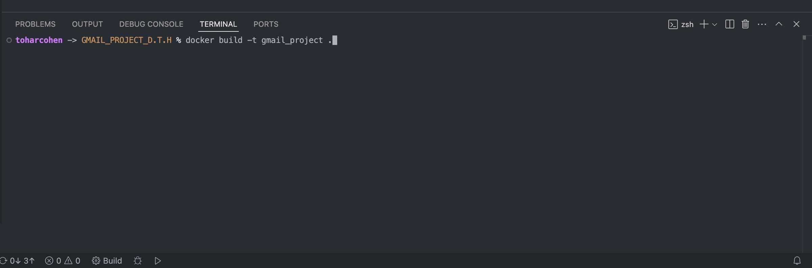
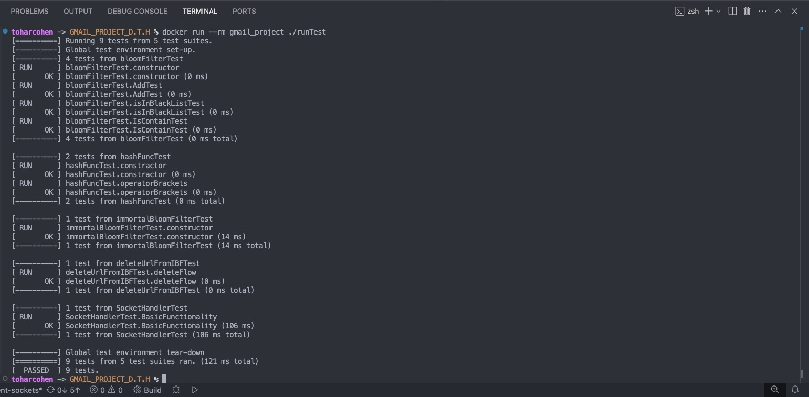
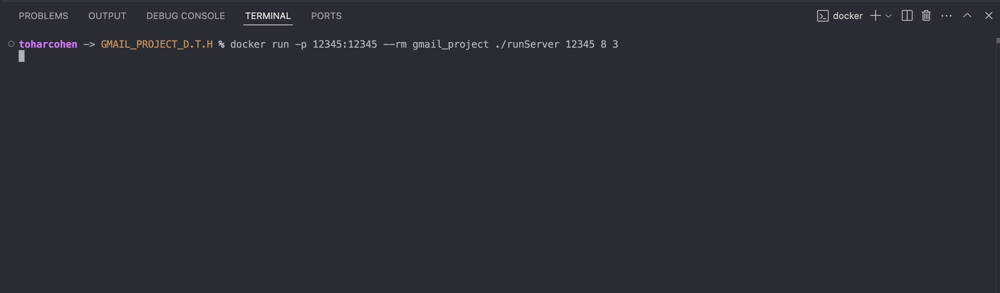
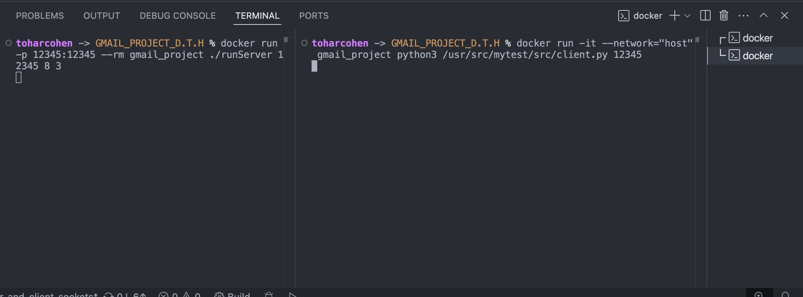

# Gmail_Project

## Overview

This project implements a Bloom Filter and related functionality in C++.  
It includes both a main program (`runProg`) and a test suite (`runTest`) using GoogleTest.

## Milestones

If you like to see a previous milestone please connect to the designated branch

Milestone 1 branch:

```sh
GPDTH-99-branch-for-milestone-1
```

## Building with Docker

The project is set up to build and run inside a Docker container using GCC and CMake.

### Build the Docker Image

From the project root directory, run:

```sh
docker build -t gmail_project .
```

## Running the Program

### Interactive Main Program

To run the main program interactively (recommended):

```sh
docker run -it gmail_project ./runProg
```

- The `-it` flag attaches an interactive terminal, allowing you to provide input to the program.

### Running the Test Suite

To run the GoogleTest-based test suite:

```sh
docker run gmail_project ./runTest
```

- This will execute all unit tests and print the results.

## Default Run Behavior

By default, when you run the Docker container **without specifying a command**, it will execute the main program:

```sh
docker run -it gmail_project
```

This is equivalent to:

```sh
docker run -it gmail_project ./runProg
```

If you want to run the test suite instead, simply specify `./runTest` as the command:

```sh
docker run gmail_project ./runTest
```

**Note:**  
- Always use `-it` when running the main program to enable interactive input.
- You do not need `-it` when running the tests.

## Usage Instructions

After running the main program `(runProg)`, you will interact with the program via the terminal.  
The program expects specific input formats and will ignore any invalid input.

### Program Flow

1. **First Line:**  
   Enter the Bloom filter array size and how many times to use the hash functions.  
   The number of numbers you write after the array size determines how many hash functions will be used.  
   Each number specifies how many times the corresponding hash function will be applied.  
   - Example: `8 1 2` (array size 8, using the first hash function once and the second hash function twice)
   - Example: `256 1 2 3 4 5 6 7`  
     (array size 256 bits, using 7 hash functions:  
     - The first hash function is applied once.  
     - The second hash function is applied twice.  
     - The third hash function is applied three times, and so on.)

2. **Commands:**  
   - To **add a URL to the blacklist**:  
     `1 [URL]`
     
     Example: `1 www.example.com0`

   - To **check if a URL is blacklisted**:  
     `2 [URL]` 
     
     Example: `2 www.example.com0`

3. **Output:**  
   - For a check `(2 [URL])`, the program prints `true true` if the URL is blacklisted and confirmed,  
     `true false` if it is a false positive, or `false` if it is not blacklisted.
   - Any input not matching the expected format is ignored.

4. **Persistence:**  
   - The Bloom filter is saved to a file after every update.
   - On restart, the program loads the previously saved Bloom filter automatically.

5. **Exiting:**  
   - To exit, you can use `Ctrl+D` or close the terminal.

### Examples

**Build Command:** 


**runTest Command:** 


**runProg Command & Code Example:** 


**Default Run Behavior & Code Example:** 


### Notes

- Only input lines in the correct format will be processed; all others are ignored.
- Output must match the examples exactly (no extra spaces, newlines, or text).
- The program supports multiple hash functions and flexible array sizes as specified in the first input line.
- The Bloom filter is persistent between runs via a file.


## Project Structure

- `main.cpp` — Entry point for the main program.
- `test.cpp` — Contains GoogleTest unit tests.
- `CMakeLists.txt` — CMake build configuration.
- `Dockerfile` — Docker build instructions.
- Other `.cpp` and `.hpp` files — Project source code.
