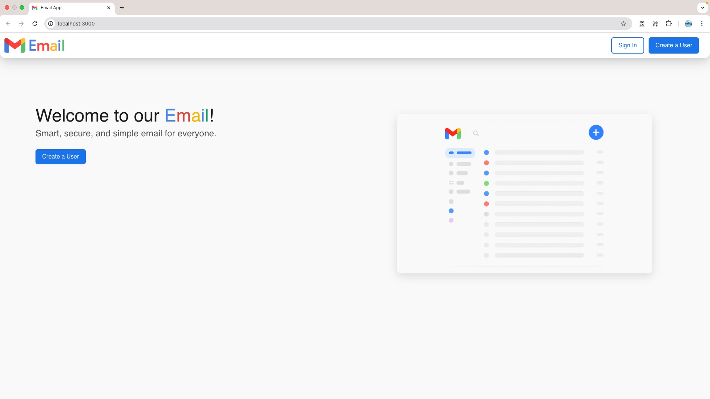
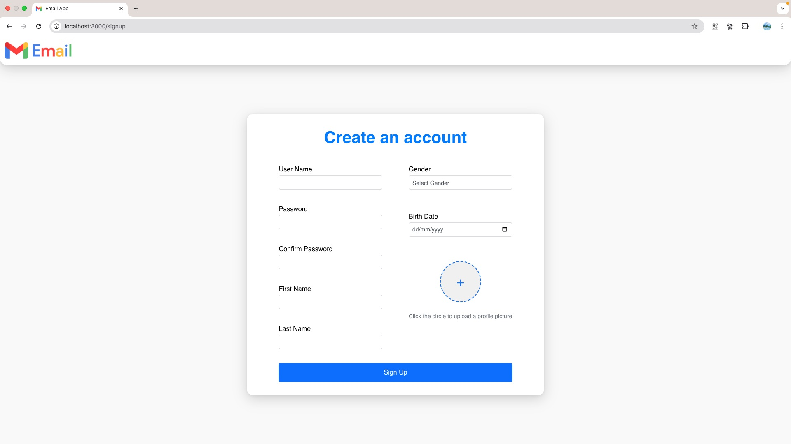
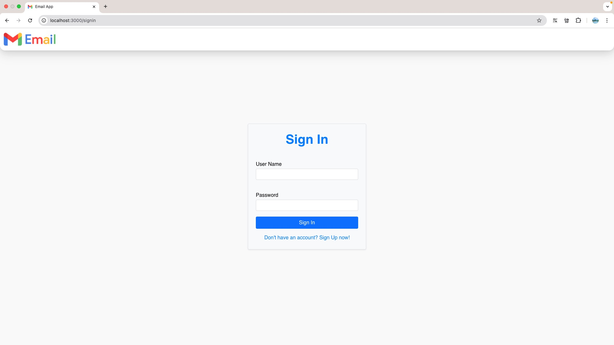
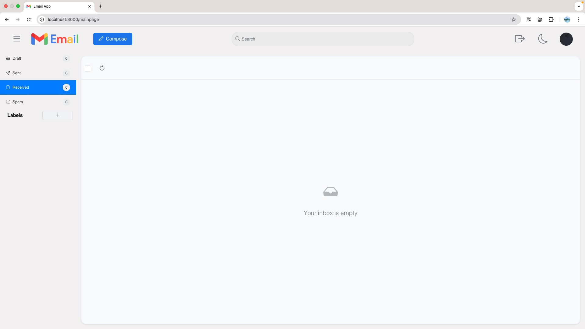
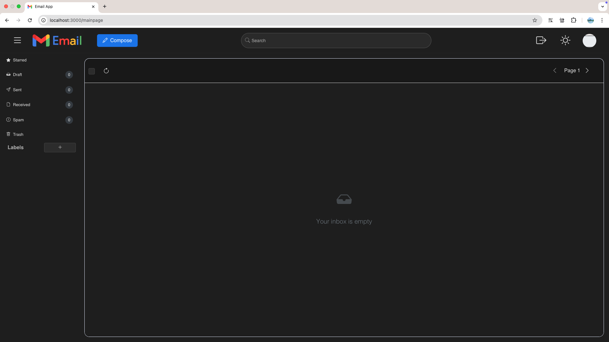

# Gmail_Project

## Overview

The Gmail Project is a comprehensive email management system that combines server-side backend infrastructure with a React-based frontend. It offers features such as email management, label creation, blacklist handling, and user authentication.

### Components

- **Blacklist Server (C++):**  
  Efficiently manages blacklisted URLs using a persistent Bloom filter.

- **Node.js Gmail Server:**  
  Provides REST API endpoints and Gmail-like application logic, integrating with the Blacklist server.

- **React Client:**  
  A responsive and scalable user interface for managing emails, labels, drafts, and blacklisted URLs.

- **Android App:**  
  A mobile application for managing emails, labels, and blacklist functionality on Android devices.

## Documentation

This README provides a brief overview of the project and its components. For detailed and comprehensive guides, visit the [Project Wiki](Wiki/Home.md).

- [Docker Setup Guide](Wiki/Installation/Docker-Setup.md)
- [Android App Installation Guide](Wiki/Installation/Android-App-Installation-Guide.md)
- [API Documentation](Wiki/API-Documentation/Authentication.md)
- [Milestone Details](Wiki/Developer-Guide/Milestones.md)

## Milestones

If you like to see a previous milestone please connect to the designated branch

Milestone 1 branch:

```sh
GPDTH-99-branch-for-milestone-1
```

Milestone 2 branch:

```sh
GPDTH-165-branch-for-milestone-2
```

Milestone 3 branch:

```sh
GPDTH-218-branch-for-milestone-3
```

Milestone 4 branch:

```sh
GPDTH-323-branch-for-milestone-4
```

## Building with Docker

This project is designed to build and run inside Docker containers. It uses GCC, CMake, Python3, Node.js, and npm to build and execute the application components.

---

## Running the Program

### Using Docker Compose

1. **Build and Start the Services**:
   - Run:
     ```sh
     docker-compose up --build
     ```
   - This command builds the Docker images and starts all services in one step.

2. **Start All Services Without Rebuilding**:
   - Run:
     ```sh
     docker-compose up
     ```
   - To run in detached mode (background):
     ```sh
     docker-compose up -d
     ```
> **Note**: Run `docker-compose build` first, then `docker-compose up`. Or use `docker-compose up --build` to do both.

3. **Stop and Clean Up**:
   - Stop the running containers:
     ```sh
     docker-compose down
     ```
   - To remove containers, images, and networks:
     ```sh
     docker-compose down --rmi all
     ```

4. **Override Runtime Arguments**:
   - Format:
     ```sh
     SERVER_PORT=<server port> NODE_PORT=<node port> BF_SIZE=<bloom filter size> HASH_COUNTS="<hash count 1> <hash count 2> ..." SERVER_HOST=<server host> docker-compose up --build
     ```
   - Example:
     ```sh
     SERVER_PORT=5555 NODE_PORT=5556 BF_SIZE=16 HASH_COUNTS="3 5 7 11" SERVER_HOST=gmail_server docker-compose up --build
     ```
>For a more comprehensive guide, visit the [Docker Setup Guide](Wiki/Installation/Docker-Setup.md).

### Running the Android App on an Emulator

1. **Open Android Studio**:  
   - Launch Android Studio on your computer.

2. **Set Up an Emulator**:  
   - Click on **AVD Manager** in the toolbar.  
   - Select **Create Virtual Device**.  
   - Choose a device (e.g., Pixel 4) and click **Next**.  
   - Select a system image (Android 7.0 or higher) and click **Next**.  
   - Name your emulator and click **Finish**.

3. **Run the App**:  
   - Open the Android project folder in Android Studio.  
   - Wait for Gradle to sync.  
   - Select your emulator from the dropdown menu.  
   - Click the green **Run** button.  
   - The app will automatically launch in the emulator once installed.

>For a more comprehensive guide, visit the [Android App Installation Guide](Wiki/Installation/Android-App-Installation-Guide.md).
---

## Key Components

### Inbox
- **InboxHeader**: Provides controls for refreshing, marking emails as read/unread, deleting emails,  and moving emails to labels include.
- **Flag as Spam**: Allows users to mark an email as spam for filtering bad URL's in future mails.
- **MessageList**: Displays a list of emails with options to select, view, or delete.
- **DraftEditor**: Allows users to edit and send drafts.

### Sidebar
- **SystemLabel**: Displays system labels like "Sent" and "Draft".
- **UserLabel**: Displays user-created labels with options to edit or delete.
- **AddLabel**: Modal for creating or editing labels.
- **Remove URL from Blacklist**: Allows users to delete a URL from the blacklist. 

### TopBar
- **Search**: Provides a search bar for filtering emails.
- **DarkMode**: Button to toggle between light and dark themes.
- **Profile**: Displays the user's profile information and provides options such as logging out or accessing account settings.

### Authentication
- **SignUp**: Form for creating a new user account.
- **SignIn**: Form for logging into the application.

## Program Flow

1. **Start all containers** using Docker Compose.  
   This will launch:
   - The C++ Blacklist server (handles blacklist validation).
   - The Node.js Gmail server (provides REST API and Gmail-like functionality).
   - The React client (provides the user interface for interacting with the system).

2. **Welcome Page**:  
   - After starting the containers, navigate to the **Welcome Page** at `http://localhost:3000`.  
   - This page provides an introduction to the application and options to either **Sign Up** or **Sign In**.  
   - Click the appropriate button to proceed.

3. **Sign Up**:  
   - Use the **Sign Up** form on the React client to create a new user.  
   - Navigate to the Sign Up page (`http://localhost:3000/signup`) and fill in the required details (e.g., username, password).  
   - Click the **Sign Up** button to submit the form.

4. **Sign In**:  
   - Use the **Sign In** form on the React client to authenticate.  
   - Navigate to the Sign In page (`http://localhost:3000/signin`) and enter your credentials.  
   - Click the **Sign In** button to log in. Upon successful authentication, you will be redirected to the main application page.

5. **Use the Mail System**:  
   - **Manage Labels**:  
     - Use the **Sidebar** to create, edit, or delete labels.  
     - Click the **Add Label** button to create a new label, or use the edit/delete options next to existing labels.

   - **Send Emails**:
     - Use the compose button to send a new mail.  
     - Navigate to the **Draft Label** to edit and send your email.  
     - Fill in the recipient, subject, and content fields, then click the **Send** button.

   - **Blacklist URLs**:  
     - Use the **Blacklist Management** button to remove URLs from the blacklist.  
     - Enter the URL in the input field and click the **Delete from Blacklist** button.
     - The button becomes visible when hovering over the spam label.
     - The URLs added to the blacklist are those that appeared in emails reported as spam by users.

> **Note**: The blacklist will identify URLs based on the patterns specified in the instructions from previous milestones, such as `www.example.com`.

   - **View Inbox**:  
     - Navigate to the **Recived Label** to view your emails.  
     - Use the search bar or filters to find specific emails, and click on an email to view its details.

> **Note**: The default port for the React client is `3000`.  
> If port 3000 is unavailable, React will automatically move to the next available port (e.g., 3001, 3002, etc.).  
> You can see the assigned port in the terminal when running

> **Note:** All interactions are performed through the React client, which communicates with the Node.js server and the C++ Bloom Filter server in the background.

> **Note:** Both servers run continuously to serve requests.  
> Stop the system at any time with `Ctrl+C` in the terminal running Docker Compose or the containers.

### Screenshots

**Building the Docker images with Docker Compose:**  


**Starting all services with Docker Compose:**  


**removing all services with Compose down:**  


**Welcome Page**  


**Sign Up Page**  


**Sign In Page**  


**Main Inbox Page**  


**Dark Mode Example**  


---

## Features

- **Inbox Management**: View, search, and filter emails by labels.
- **Draft Editor**: Create, edit, and send email drafts.
- **Label Management**: Add, edit, and delete labels.
- **Blacklist Management**: Add or remove URLs from the blacklist.
- **User Authentication**: Sign up and sign in functionality.
- **Dark Mode**: Toggle between light and dark themes.

## Project Structure

The React application is organized as follows:

```
GMAIL_PROJECT_D.T.H/
├── src/                             # Project source code
│   ├── client/                      # React frontend application
│   │   ├── .gitignore               # Git ignore file for React client
│   │   ├── package.json             # React client dependencies
│   │   ├── src/                     # React source code
│   │       ├── components/          # Reusable UI components
│   │       │   ├── Inbox/           # Inbox-related components
│   │       │   ├── SideBar/         # Sidebar and label management
│   │       │   ├── TopBar/          # Top navigation bar
│   │       │   ├── SignUp/          # Sign-up form components
│   │       │   ├── SignIn/          # Sign-in form components
│   │       │   ├── FetchWithAuth/   # Authenticator component
│   │       │   ├── Styles/          # Styles component
│   │       │   
│   │       ├── pages/  
│   │       │   ├── SignUp/          # Sign-up page
│   │       │   ├── SignIn/          # Sign-in page
│   │       │   ├── MainPage/        # Main application page
│   │       │   ├── WelcomePage/     # Welcome page
│   │       │
│   │       ├── utils/               # Utility functions
│   │       ├── config/              # Configuration files (e.g., API URLs)
│   │       ├── index.js             # Application entry point
│   │       ├── App.js               # Main application component
│   │
│   ├── blacklist/                   # C++ Bloom Filter server implementation
│   │   ├── cpp/                     # C++ source files
│   │   ├── hpp/                     # C++ header files
│   │   ├── client.py                # Python client for testing the server
│   │
│   ├── server/ 
│       ├── controllers/                 # Node.js controllers for handling API logic
│       ├── models/                      # Node.js models for database and application logic
│       ├── routes/                      # Node.js routes for API endpoints
│       │── app.js                       # Main Node.js server file
│       │── package.json                 # Node.js server dependencies
│
├── images/                          # Project images for documentation  
├── .env                             # Environment variables for the project
├── .dockerignore                    # Docker ignore file
├── .gitignore                       # Git ignore file
├── CMakeLists.txt                   # CMake configuration for building the C++ server
├── Dockerfile                       # Dockerfile for building the project
├── docker-compose.yml               # Docker Compose configuration
├── README.md                        # Project documentation
├── details.txt                      # Project details (authors, repository link, etc.)
```

## Requirements

- [Docker](https://www.docker.com/) (with Docker Compose)
- A web browser to access the React client