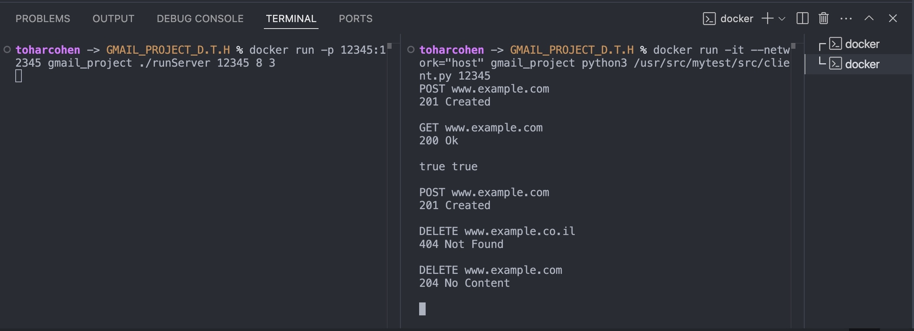

# Gmail_Project

## Assignment Questions & Answers

1. **Did the fact that the command names changed require you to touch code that is supposed to be "closed to changes but open to expansion"?**  
   No, what we did in Exercise 1 was just create a map for the commands, where we changed the command number to its name (like 1 to POST). We only added the print statements inside the command classes and didn’t touch any code outside of them.

2. **Did the fact that new commands were added require you to touch code that is supposed to be "closed to changes but open to expansion"?**  
   No, we simply created a new class that inherits from the `iCommand` interface, and then added it to the command map. We didn’t change anything outside the new command class.

3. **Did the fact that the command output changed require you to touch code that is supposed to be "closed to changes but open to expansion"?**  
   No, we only added print statements inside the command classes and didn’t touch anything outside of them.

4. **Did the fact that the input/output comes from sockets and not from the console require you to touch the code that is "closed to changes but open to extension"?**  
   Yes, originally we planned for the input/output classes to be changeable, so we used `std::ifstream` and `std::ofstream` because they work with both standard input/output and files. We noticed that this could also work with sockets, but in the end we decided to create our own class `iOutputHandler` to make things clearer and more convenient and to avoid problems later on.

## Overview

This project implements a Bloom Filter and related functionality in C++ using a client-server architecture.  
It includes a C++ server (`runServer`), a Python client (`client.py`), and a test suite (`runTest`) using GoogleTest.

## Milestones

If you like to see a previous milestone please connect to the designated branch

Milestone 1 branch:

```sh
GPDTH-99-branch-for-milestone-1
```

## Building with Docker

The project is set up to build and run inside a Docker container using GCC, CMake, and Python3.

### Build the Docker Image

From the project root directory, run:

```sh
docker build -t gmail_project .
```

## Running the Program

### Running the Server

You can run the server in several ways:

#### 1. Using Docker Directly

**General format:**
```
docker run -p <port>:<port> gmail_project ./runServer <port> <bloom_filter_size> <hash_count> [additional_hash_counts...]
```
- `<port>`: Port number (**1024–65535**)
- `<bloom_filter_size>`: Bloom filter size
- `<hash_count>`: Number of hash functions (add more numbers for more hash functions if needed)

**Example:**
```
docker run -p 12345:12345 gmail_project ./runServer 12345 8 3
```

#### 2. Using the Provided Script

First, give the script execute permission:
```
chmod +x ./rscripts/run_server.sh
```
Then run:
```
./rscripts/run_server.sh <port> <bloom_filter_size> <hash_count> [additional_hash_counts...]
```
**Example:**
```
./rscripts/run_server.sh 12345 8 3
```

---

### Running the Client

You can also run the client in multiple ways:

#### 1. Using Docker Directly

**General format:**
```
docker run -it --network="host" gmail_project python3 /usr/src/mytest/src/client.py <port>
```
- `<port>`: Port number to connect to (**should match the server port**)

**Example:**
```
docker run -it --network="host" gmail_project python3 /usr/src/mytest/src/client.py 12345
```

#### 2. Using the Provided Script

First, give the script execute permission:
```
chmod +x ./rscripts/run_client.sh
```
Then run:
```
./rscripts/run_client.sh <port>
```
**Example:**
```
./rscripts/run_client.sh 12345
```

---

*Note: The specific command examples above are just for illustration. You can use any valid port (1024–65535) and parameters as needed.*

### Running the Test Suite

To run the GoogleTest-based test suite:

```sh
docker run gmail_project ./runTest
```

- This will execute all unit tests and print the results.

## Usage Instructions

After starting both server and client, interact with the system through the client terminal using the following commands:

1. **POST (Add a URL to the blacklist):**
   ```
   POST www.example.com
   ```

2. **GET (Check if a URL is blacklisted):**
   ```
   GET www.example.com
   ```

3. **DELETE (Remove a URL from the blacklist):**
   ```
   DELETE www.example.com
   ```

- The server will respond with the result of your command.

---

**Note:**  
- Only input lines in the correct format will be processed; all others are ignored.
- Output must match the examples exactly (no extra spaces, newlines, or text).
- The Bloom filter is persistent between runs via a file.

## Program Flow

1. **Start the server** in one terminal with the desired configuration (port, bloom filter size, hash count).
2. **Start the client** in another terminal and connect to the server.
3. **Send commands** from the client to the server using the POST, GET, and DELETE formats as shown above.
4. **Server processes the commands** and responds accordingly.
5. **Bloom filter state is saved** after every update and loaded automatically on server restart.
6. **To exit:**  
   - Use `Ctrl+D` or close the client terminal to disconnect the client.
   - Use `Ctrl+C` in the server terminal to stop the server.

### Examples

**Build Command:**  


**runTest Command:**  


**Server Run Command:**  


**Client Run Command:**  


**Sample Client Interaction:**  


---

## Project Structure

- `src/main.cpp` — Server program entry point
- `src/server.cpp/hpp` — Server implementation
- `src/socketHandler.cpp/hpp` — Socket communication handling
- `src/client.py` — Python client implementation
- `src/bloomFilter.cpp/hpp`, `src/immortalBloomFilter.cpp/hpp` — Bloom filter implementation
- `src/test.cpp` — Test suite
- `CMakeLists.txt` — Build configuration
- `Dockerfile` — Docker configuration

## Requirements

- Docker
- Two terminal windows (one for server, one for client)