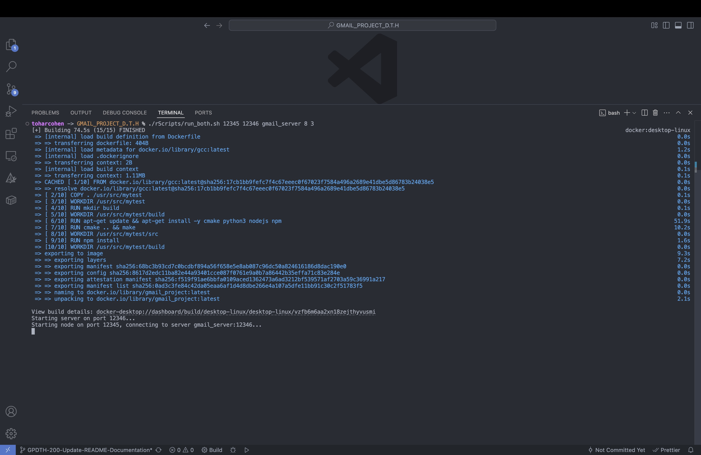
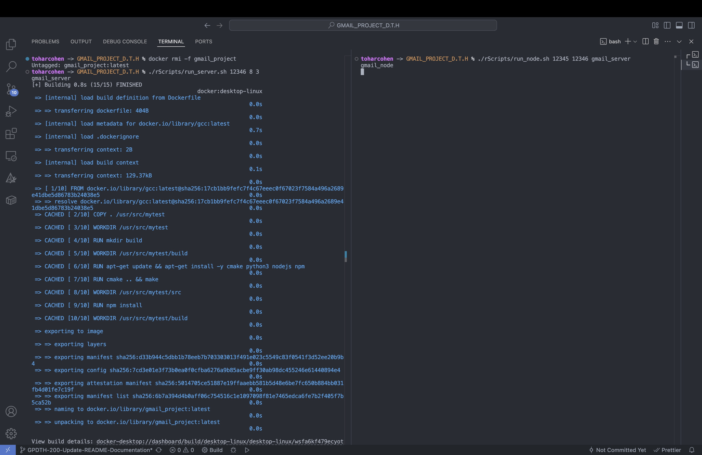
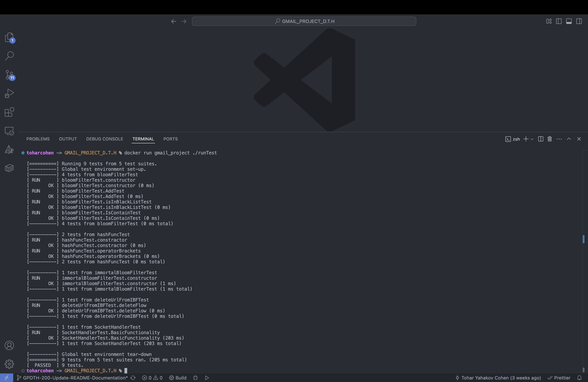
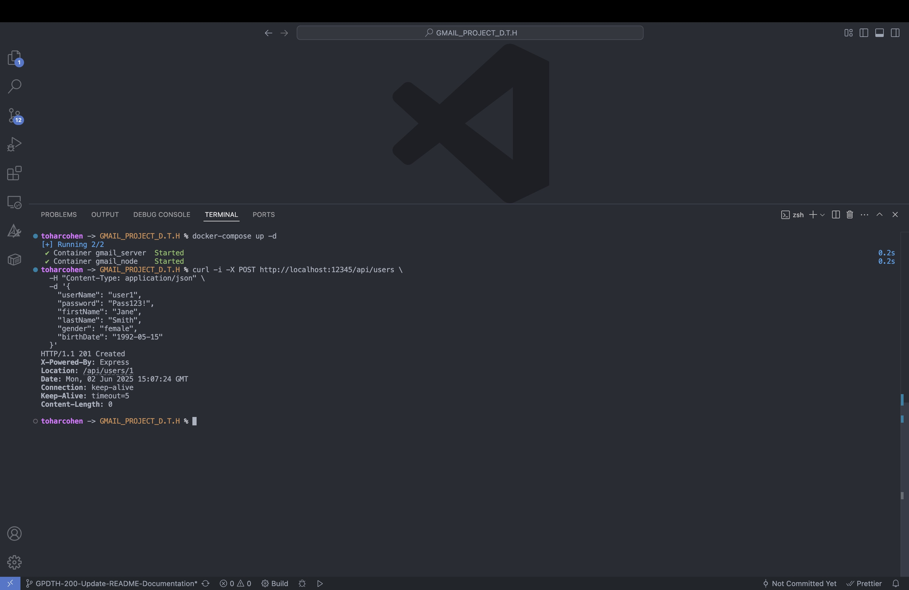
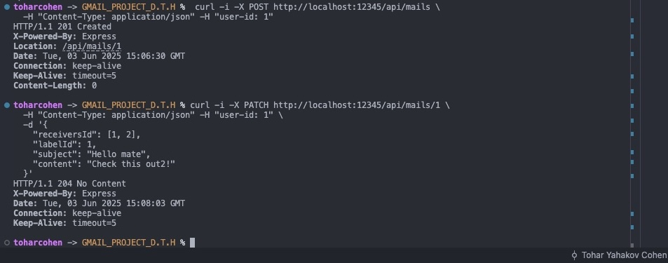

# Gmail_Project

## Overview

This project implements the server-side of our Gmail Project, focusing on backend infrastructure and security.  
It includes:

- **Bloom Filter Server (C++):**  
  Maintains a persistent Bloom filter to efficiently check and manage blacklisted (bad) URLs.

- **Node.js Gmail Server:**  
  Provides Gmail-like application logic and REST API endpoints, communicating with the Bloom filter server to validate URLs.

Together, these services form the backend infrastructure for a secure, scalable Gmail-like system with robust URL filtering.

## Milestones

If you like to see a previous milestone please connect to the designated branch

Milestone 1 branch:

```sh
GPDTH-99-branch-for-milestone-1
```

Milestone 2 branch:

```sh
GPDTH-165-branch-for-milestone-2
```

Milestone 3 branch:

```sh
GPDTH-218-branch-for-milestone-3
```

## Building with Docker

This project is designed to build and run inside Docker containers using GCC, CMake, Python3, Node.js, and npm.

## Running the Program

1. **Using Docker Compose**

First, build the image (only needed after changes or the first time):

```sh
docker-compose build
```

Default run:

```sh
docker-compose up
```

To run in the background (detached mode):

```sh
docker-compose up -d
```

Change arguments at runtime:

Format:

```sh
SERVER_PORT=<server port> NODE_PORT=<node port> BF_SIZE=<bloom filter size> HASH_COUNTS="<hash count 1> <hash count 2> ..." SERVER_HOST=<server host> docker-compose up
```

Example:

```sh
SERVER_PORT=5555 NODE_PORT=5556 BF_SIZE=16 HASH_COUNTS="3 5 7 11" SERVER_HOST=gmail_server docker-compose up
```

How to stop and clean up:

You can stop the running containers at any time with `Ctrl+C`.  
To remove containers and clean up images/networks, run:

```sh
docker-compose down --rmi all
```

> By default, Compose uses values from the `.env` file.  
> Overriding variables inline only affects that run and does **not** change the `.env` file.

---

2. **Using the `run_both.sh` Script**

Format:

```sh
./rScripts/run_both.sh <node_port> <server_port> <server_host> [additional server args]
```

Example:

```sh
./rScripts/run_both.sh 12345 12346 gmail_server 8 3
```

> This starts both the server and node in the **same terminal window**.

> **Note:** If you don't have permissions, give any script execute permission with  
> `chmod +x ./rScripts/run_both.sh`


---

3. **Using `run_server.sh` and `run_node.sh` Separately**

**First, clear the image to avoid conflicts with other images:**

```sh
docker rmi -f gmail_project
```

**Run the server (in the first terminal):**

Format:

```sh
./rScripts/run_server.sh <server_port> [additional server args]
```

Example:

```sh
./rScripts/run_server.sh 12346 8 3
```

> **Note:** If you don't have permissions, give any script execute permission with  
> `chmod +x ./rScripts/run_server.sh`

**Open a separate terminal and run the node:**

Format:

```sh
./rScripts/run_node.sh <node_port> <server_port> <server_host>
```

Example:

```sh
./rScripts/run_node.sh 12345 12346 gmail_server
```

> **Note:** If you don't have permissions, give any script execute permission with  
> `chmod +x ./rScripts/run_node.sh`

---

4. **Simplest Docker Run Commands**

**First, build the image:**

```sh
docker build -t gmail_project .
```

**Run the server (in the first terminal):**

Format:

```sh
docker run --network gmailnetdth --name gmail_server -p <server_port>:<server_port> gmail_project ./runServer <server_port> [additional server args]
```

Example:

```sh
docker run --network gmailnetdth --name gmail_server -p 12346:12346 gmail_project ./runServer 12346 8 3
```

**Open a separate terminal and run the node:**

Format:

```sh
docker run --network gmailnetdth --name gmail_node -p <node_port>:<node_port> gmail_project node /usr/src/mytest/src/app.js <node_port> <server_port> <server_host>
```

Example:

```sh
docker run --network gmailnetdth --name gmail_node -p 12345:12345 gmail_project node /usr/src/mytest/src/app.js 12345 12346 gmail_server
```

> **Note:** If you use a different image or network name, update the commands accordingly.

---

> **Note:** If you don't have permissions, give any script execute permission with  
> `chmod +x <script_path>`


### Running the Test Suite

To run the GoogleTest-based test suite:

**First, build the image:**

```sh
docker build -t gmail_project .
```

**Then, run the tests:**

```sh
docker run gmail_project ./runTest
```

- This will execute all unit tests and print the results.

## Usage Instructions

After starting both containers (Node.js server and Bloom filter server), you can interact with the system using the provided REST API endpoints.  
Below are example `curl` commands for common operations:

> **Note:** All example commands below assume the Node.js server is running on port **12345**.

### USERS

- **Post - create new user:**
  ```sh
  curl -i -X POST http://localhost:12345/api/users \
  -H "Content-Type: application/json" \
  -d '{ 
    "userName": "user1",
    "password": "Pass123!",
    "firstName": "Jane",
    "lastName": "Smith",
    "gender": "female",
    "birthDate": "1992-05-15"
  }'
  ```

- **Get - get user by id:**
  ```sh
  curl -i -X GET http://localhost:12345/api/users/1
  ```

### TOKENS

- **Post - sign in:**
  ```sh
  curl -i -X POST http://localhost:12345/api/tokens \
  -H "Content-Type: application/json" \
  -d '{
    "userName": "user1",
    "password": "Pass123!"
  }'
  ```

### LABELS

- **Get - get all labels:**
  ```sh
  curl -i -X GET http://localhost:12345/api/labels -H "user-id: 1"
  ```

- **Post - create label:**
  ```sh
  curl -i -X POST http://localhost:12345/api/labels \
  -H "Content-Type: application/json" -H "user-id: 1" \
  -d '{"name": "Work"}'
  ```
> **Note:** Reserved labels: id = 0,1,2 (Draft, Sent, Received).  
> You cannot create or modify labels with these IDs.

- **Get - get label by id:**
  ```sh
  curl -i -X GET http://localhost:12345/api/labels/1 -H "user-id: 1"
  ```

- **Patch - update a label name:**
  ```sh
  curl -i -X PATCH http://localhost:12345/api/labels/3 \
  -H "Content-Type: application/json" \
  -H "user-id: 1" \
  -d '{"name": "UpdatedLabel"}'
  ```

- **Delete - delete a label by a specific id:**
  ```sh
  curl -i -X DELETE http://localhost:12345/api/labels/3 -H "user-id: 1"
  ```

> **Note:** When a label is deleted, all mails associated with that label will automatically revert to their original status (either "sent" or "received") based on each mail's status.

### MAILS

- **Get - get last 50 mails:**
  ```sh
  curl -i -X GET http://localhost:12345/api/mails -H "user-id: 1"
  ```

> **Note:**  exclude Draft mails.

- **Post - create a mail:**
  ```sh
  curl -i -X POST http://localhost:12345/api/mails \
  -H "Content-Type: application/json" -H "user-id: 1"
  ```

> **Note:** Creating a mail will create an empty draft mail.  
> To actually send the mail, you must update it using the PATCH endpoint with the required fields (must field: labelId = 1 (sent), at least one valid receiver).

- **Get - search string in all mails:**
  ```sh
  curl -i -X GET http://localhost:12345/api/mails/search/Hello -H "user-id: 1"
  ```

- **Get - get a mail by id:**
  ```sh
  curl -i -X GET http://localhost:12345/api/mails/1 -H "user-id: 1"
  ```

- **Patch - update a mail (subject/content/labelId/receiversId):**
  ```sh
  curl -i -X PATCH http://localhost:12345/api/mails/1 \
  -H "Content-Type: application/json" -H "user-id: 1" \
  -d '{
    "receiversId": [1],
    "labelId": 1,
    "subject": "Hello mate",
    "content": "Check this out2!"
  }'
  ```

> **Note:** For mails that have already been sent, only the label can be updated.

- **Delete - delete a mail by a specific id:**
  ```sh
  curl -i -X DELETE http://localhost:12345/api/mails/1 -H "user-id: 1"
  ```

### BLACKLIST

- **Post - add a url to the blacklist:**
  ```sh
  curl -i -X POST http://localhost:12345/api/blacklist \
  -H "Content-Type: application/json" \
  -d '{"url": "www.example.com"}'
  ```

- **Delete - delete a url from the blacklist:**
  ```sh
  curl -i -X DELETE http://localhost:12345/api/blacklist/www.example.com
  ```
  
> **Note:** The server validates the JSON body of each `curl` request for required fields and correct data types.  
> Make sure your request body matches the expected format, otherwise the server will respond with an error.

> Replace IDs and data as needed for your use case.  
> All endpoints are available once both containers are running.
---

## Program Flow

1. **Start both containers** using one of the provided methods.
 This will launch:
   - The C++ Bloom filter server (handles blacklist logic)
   - The Node.js Gmail server (handles REST API and Gmail-like features)

2. **Interact with the system** by sending HTTP requests (using `curl` or similar tools) to the Node.js server
on port **12345**.

   Use the example commands in the "Usage Instructions" section for creating users, signing in, managing labels, sending mails, and updating the blacklist.

3. **The Node.js server** processes your requests, communicates with the Bloom filter server as needed, and returns responses.

4. **Bloom filter state** is automatically saved and loaded by the server for persistence.

> **Note:** Both servers run continuously to serve requests.  
> Stop the system at any time with `Ctrl+C` in the terminal running Docker Compose or the containers.

### Examples

**Building the Docker images with Docker Compose:**  


**Starting all services with Docker Compose:**  


**removing all services with Compose down:**  


**Running both servers with the helper script:**  


**Running the C++ server and Node.js server separately:**  
  

**Running the test suite:**  


**Sample API interaction (creating a user):**  


**Secound sample API interaction (creating a mail):**  


---

## Project Structure

- `src/blacklist/cpp/main.cpp` — C++ Bloom filter server entry point
- `src/blacklist/cpp/server.cpp` / `server.hpp` — Server logic
- `src/blacklist/cpp/bloomFilter.cpp` / `bloomFilter.hpp` — Bloom filter logic
- `src/app.js` — Node.js Gmail server (REST API and Gmail logic)
- `CMakeLists.txt` — C++ build configuration
- `Dockerfile` — Docker build instructions
- `docker-compose.yml` — Multi-container orchestration
- `rScripts/` — Helper scripts for running containers

## Requirements

- [Docker](https://www.docker.com/) (with Docker Compose)
- Two terminal windows (one for the server, one for the Node.js Gmail server)
- (Optional) `curl` or similar tool for making HTTP requests to the API