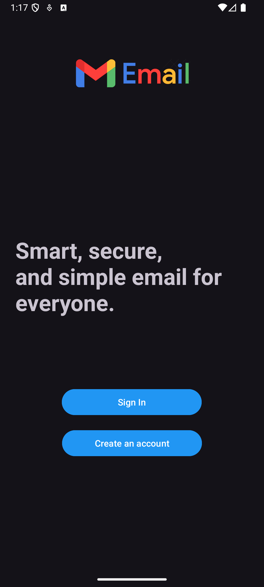
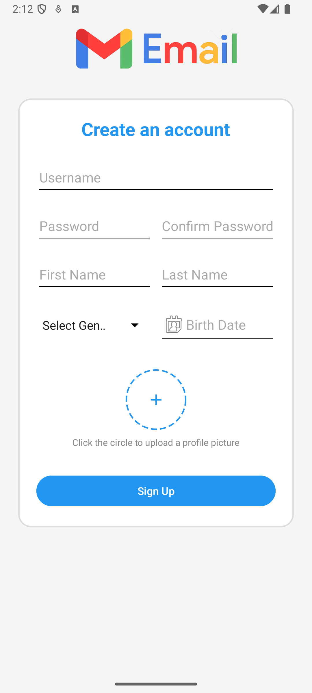
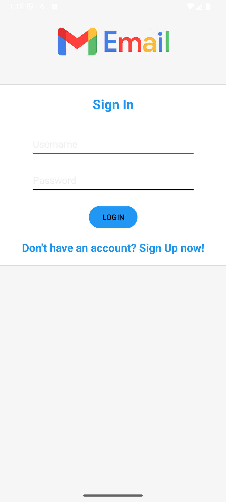
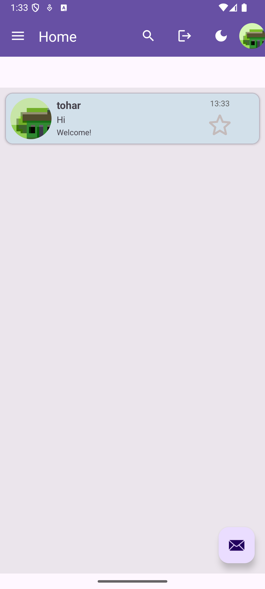
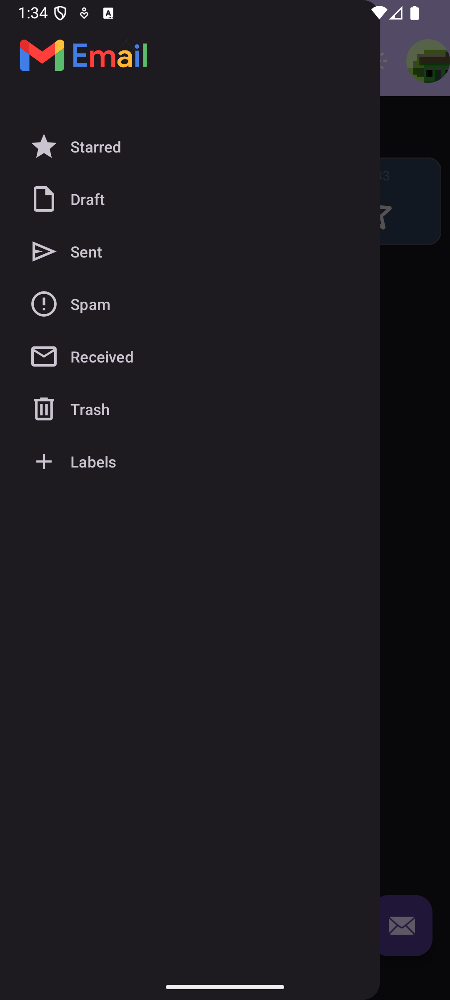
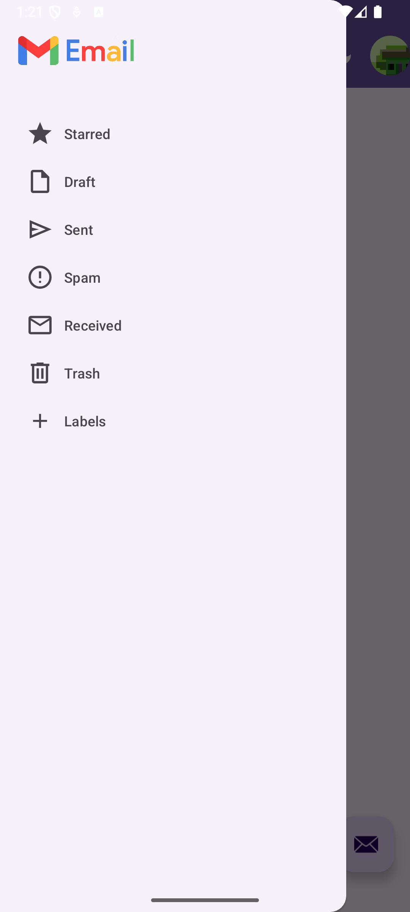
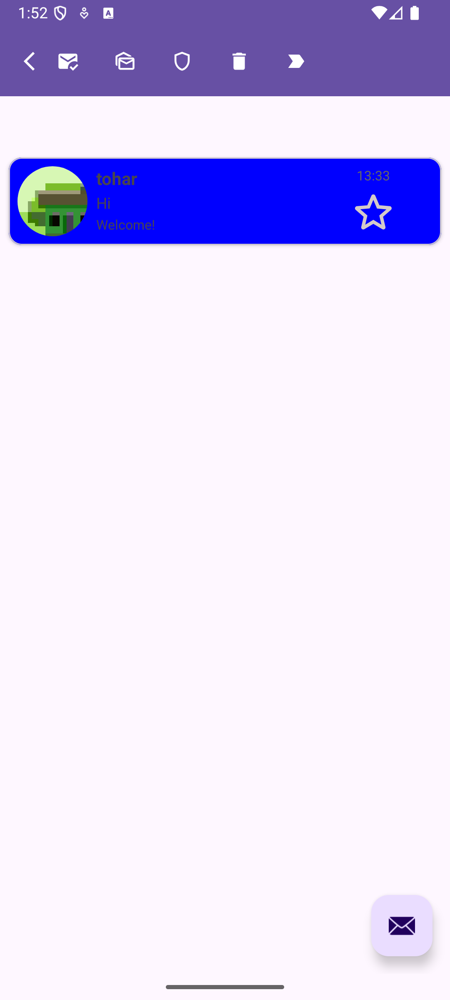

# Getting Started with the Gmail Project Android App

Welcome to the Gmail Project Android App! This guide will help you get started with using our mobile email application.

## Account Setup

### Creating a New Account

1. Launch the app on your Android device
2. On the Welcome screen, tap "Sign Up"
3. Fill in your details on the registration form:
   - Username (unique identifier)
   - Password (and confirm password)
   - First Name
   - Last Name
   - Gender (select from dropdown)
   - Birth Date (tap to open date selector)
   - Profile Picture (tap the image icon to take a photo or select from gallery)
4. Tap "Sign Up" to create your account
5. After successful registration, you'll be redirected to the Sign In screen

### Signing In

1. On the Welcome screen, tap "Sign In"
2. Enter your credentials:
   - Username
   - Password
3. Tap "Sign In"
4. Upon successful authentication, you'll be redirected to your inbox

## User Interface Overview

### Main Interface Components

The Android app interface is organized into several key areas:

1. **App Bar**: Contains the app title, search icon, logout & darkmode buttons and user profile
2. **Navigation Drawer**: Access system and custom labels (swipe from left edge or tap ☰)
3. **Email List**: View emails in the currently selected label
4. **Floating Action Button (FAB)**: Compose new emails
5. **Bulk Action Bar**: Appears when selecting multiple emails (long-tap on an email to enable multiple selection mode) 

## Basic Email Operations

### Composing a New Email

1. Tap the floating action button (closed envelop icon) at the bottom right
2. In the compose dialog:
   - Enter recipient usernames separated by commas
   - Enter a subject line
   - Write your message
3. Tap "Send" to deliver or "Cancel" to save as draft

### Reading Emails

1. Your received emails appear in your inbox
2. Tap any email to open and read its contents
3. The email will be automatically marked as read
4. Use the back button to return to your email list

### Managing Drafts

1. If you cancel composition with content entered, your email is saved as a draft
2. Access your drafts by selecting the "Draft" label in the navigation drawer
3. Tap on a draft to continue editing
4. When ready, tap "Send" to deliver the email

## Email Management

### Organizing Emails

1. Long-press on an email to enter selection mode
2. Tap additional emails to select multiple items
3. Use the action buttons to:
   - Mark as read (open envelope icon)
   - Mark as unread (closed envelope icon)
   - Delete (trash icon)
   - Move to another label 
   - Mark as spam (shield icon)

### Moving Emails Between Labels

1. Select one or more emails
2. Tap the folder icon in the bulk action bar
3. Choose the destination label from the dialog
4. The emails will be moved to that label

## Label Management

### Using Labels

1. Open the navigation drawer by swiping from the left edge
2. You'll see system labels like Inbox, Sent, Draft, Spam, and Trash
3. Custom labels appear in their own section

### Creating New Labels

1. In the navigation drawer, tap the "+" icon next to Labels
2. Enter a name for your new label
3. Tap "Add" to create the label

### Editing and Deleting Labels

1. Tap the floating action button at the bottom left (it will appear only when you are on a user label)
2. Select "Edit" or "Delete" from the options
3. Follow the prompts to complete your action

## Search Functionality

1. Tap the search icon in the app bar
2. Enter your search terms
3. Results will display emails matching your search criteria
4. The search looks for matches in sender name, subject, and content

## Spam Management

### Marking Emails as Spam

1. Select one or more emails
2. Tap the shield icon
3. The emails will be moved to the Spam label
4. URLs in these emails will be automatically added to the blacklist

### Removing Emails from Spam

1. Navigate to the Spam label in the navigation drawer
2. Select the email(s) you want to recover
3. Tap the shield with arrow icon
4. The emails will be moved back to the inbox
5. URLs in these emails will be removed from the blacklist

## Profile Management

1. Tap your profile icon in the app bar or select "User Profile" from the menu
2. View your profile information:
   - Username
   - Full name
   - Gender
   - Birth date
   - Profile picture
3. Tap "Close" to return to the main interface

## Next Steps

Now that you're familiar with the basics, explore these guides for more details:

[Overview](Overview.md) - High-level overview of the Android app's features and architecture
- [User Interface](User-Interface.md) - Detailed overview of the Android app interface
- [Features Guide](Features-Guide.md) - Comprehensive feature documentation
- [Settings Guide](Settings-Guide.md) - Customizing your app experience

### Screenshots

<table>
  <tr>
    <td width="50%" align="center">
      
<strong>App Welcome Page</strong>

      
    </td>
    <td width="50%" align="center">
      
<strong>App Sign Up Page</strong>

      
    </td>
  </tr>
  <tr>
    <td width="50%" align="center">
      
<strong>App Sign In Page</strong>

      
    </td>
    <td width="50%" align="center">
      
<strong>App Main Inbox Page</strong>

      
    </td>
  </tr>
  <tr>
    <td width="50%" align="center">
      
<strong>App Dark Mode Example</strong>

      
    </td>
    <td width="50%" align="center">
      
<strong>App Navigation Drawer</strong>

      
    </td>
  </tr>
  <tr>
    <td width="50%" align="center">
      
<strong>App Top-Bar On Select</strong>

      
    </td>
    <td width="50%" align="center">
      <!-- Empty cell or another image -->
    </td>
  </tr>
</table>

