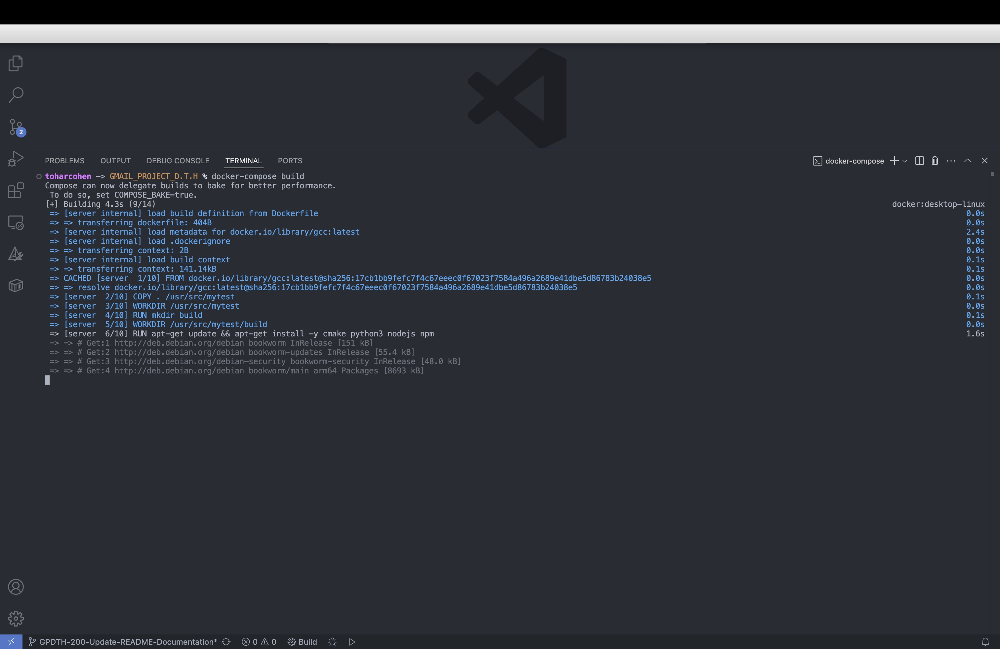
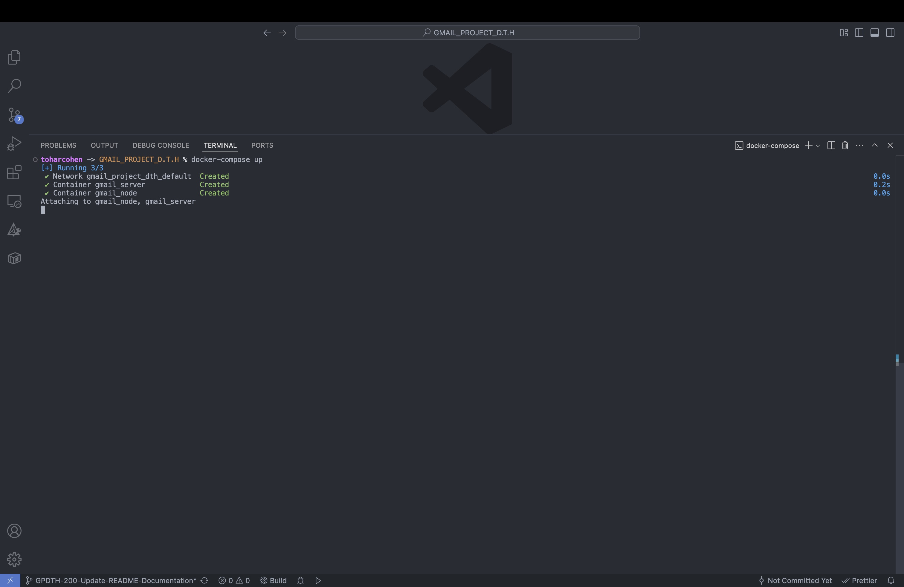
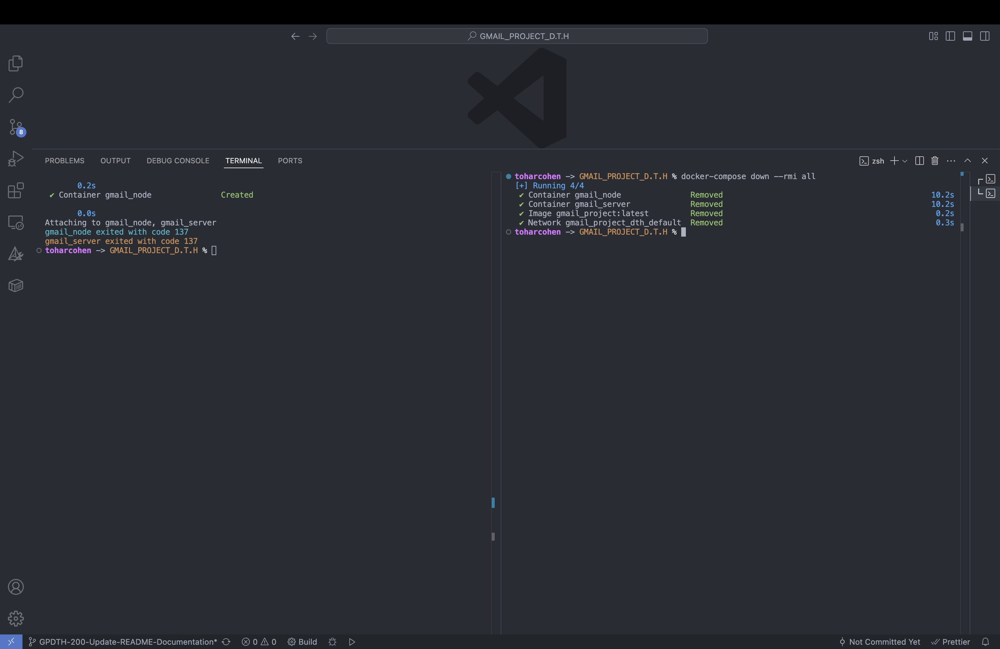

# Docker Setup Guide

This guide explains how to set up the Gmail Project using Docker for easy deployment.

## Prerequisites

- Docker installed on your machine
- Docker Compose installed on your machine
- Git for cloning the repository

## Quick Configuration

To change ports or configuration:

Edit the `.env` file in the project root:
```
NODE_PORT=12347       # API server port
SERVER_PORT=12348     # C++ server port
ANDROID_API_HOST=192.168.1.100  # For Android app connection
```

For all configuration options, see the [Configuration Guide](Configuration.md).

## Installation Steps

1. Clone the repository:
   ```bash
   git clone https://github.com/danieljenudi/GMAIL_PROJECT_D.T.H.git
   cd GMAIL_PROJECT_D.T.H
   ```

2. Build the Docker images:
   ```bash
   docker-compose build
   ```

3. Start the containers:
   ```bash
   docker-compose up -d
   ```

4. Verify process build success:
   ```bash
   docker-compose ps
   ```

>**Note:** You can also use a single command to build and start containers at once:
>```bash
>docker compose up --build -d
>```
>This command combines steps 2 and 3 by building the images and starting the containers in one operation. The `-d` flag runs containers in detached mode (in the background).

## Container Structure

The Docker setup includes the following containers:
- Frontend container (React/JavaScript/CSS)
- Backend API container (Node.js)
- Database container (MongoDB)
- C++ Blacklist server

## Configuration

All Docker configurations are available in the `Dockerfile` and `docker-compose.yml` files in the root directory.

### Connection Issues
If you experience connection issues between containers, check the network configuration in your `docker-compose.yml` file.

### Port Conflicts
If you encounter port conflicts, modify the port mappings in the `.env` file.

## Client Options

After setting up the Docker environment, you can access the Gmail application through:

- Web browser: If you'd like to use the React web client, refer to the [React Getting Started Guide](../React-User-Guide/Getting-Started.md) for use instructions.

- Android app: If you'd like to use the Android app as a client, refer to the [Android App Installation Guide](./Android-App-Installation-Guide.md) for setup instructions.

This provides flexibility to access your email system through multiple platforms while using the same backend infrastructure.

## Further Information

For advanced Docker configurations, refer to the [Development-Environment.md](Development-Environment.md) document.


### Screenshots

**Building the Docker images with Docker Compose:**  


**Starting all services with Docker Compose:**  


**Removing all services with Docker Compose Down:**  

